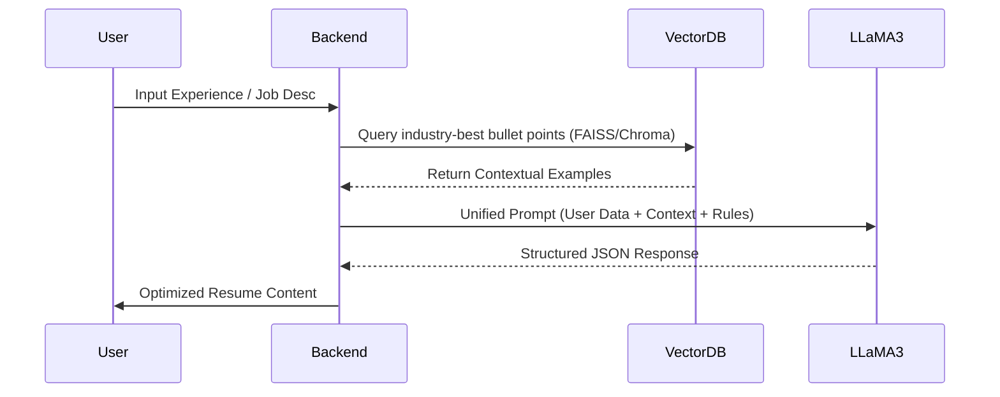

# AI Pipeline - LLaMA-3 + RAG Strategy

This document details how the **AI Resume Builder** leverages LLaMA-3 and Retrieval-Augmented Generation (RAG) to produce superior resume content and job-matching analysis.

---

## 🚀 The Core AI Strategy

Unlike simple GPT wrappers, our platform uses a **custom AI Pipeline** that combines Large Language Models (LLMs) with a domain-specific knowledge base.

### Pipeline Workflow

---

## 🧠 Components of the Pipeline

### 1. Retrieval-Augmented Generation (RAG)
To prevent "hallucinations" and ensure resumes meet industry standards, we maintain a vector database of:
- **High-Impact Action Verbs:** Curated list for ATS optimization.
- **Skill Taxonomies:** Mappings of technical and soft skills per industry.
- **Top-Tier Resume Examples:** Real-world bullet points that led to hires at FAANG and top startups.

### 2. Prompt Engineering System
Our prompts are structured using the **Chain-of-Thought (CoT)** methodology:
- **Role Definition:** "Act as a Senior HR Executive with 20 years of experience..."
- **Constraint Enforcement:** "Ensure no buzzwords like 'synergy' are used. Focus on metrics (X, Y, Z formula)."
- **Output Structuring:** Force the AI to return data in a strictly typed JSON schema for seamless frontend integration.

### 3. ATS Optimization Engine
The AI doesn't just write; it analyzes. 
- **Keyword Extraction:** Identifies hard skills in the job description using NER (Named Entity Recognition).
- **Match Scoring:** Calculates a semantic similarity score between the resume and the job description.
- **Gap Analysis:** Suggests specific sections to add or modify to rank higher in ATS systems.

---

## 🛠️ Technology Stack (AI)

| Component | Technology | Purpose |
| :--- | :--- | :--- |
| **Model** | LLaMA-3-8B-Instruct | High-performance inference for content generation. |
| **Framework** | LangChain | Managing LLM chains, memory, and tool integration. |
| **Embeddings** | HuggingFace (all-MiniLM-L6-v2) | Converting text to vectors for semantic search. |
| **Inference Server** | Ollama / Groq | Running the LLaMA model with high throughput. |
| **Vector DB** | ChromaDB / FAISS | Storing and retrieving expert-level resume data. |

---

## 📈 Quality Control (Evaluation)

We use a "Judge LLM" pattern (often a larger LLaMA-3-70B model) to periodically audit the output of our generation pipeline:
1. **Grammar & Tone Check:** Ensuring a professional, confident voice.
2. **Relevance Check:** Verifying that suggested skills actually match the user's field.
3. **Format Validation:** Ensuring the industry-standard "Action Verb + Task + Result" pattern is used in bullet points.

---

## 🛠️ How to Tweak the Pipeline
Developers can modify the AI behavior by editing the prompt templates in `backend/ai/prompts/`:
- `resume_base.py`: General resume generation logic.
- `ats_match.py`: Logic for comparing resumes to job descriptions.
- `cover_letter.py`: Personalized cover letter templates.
