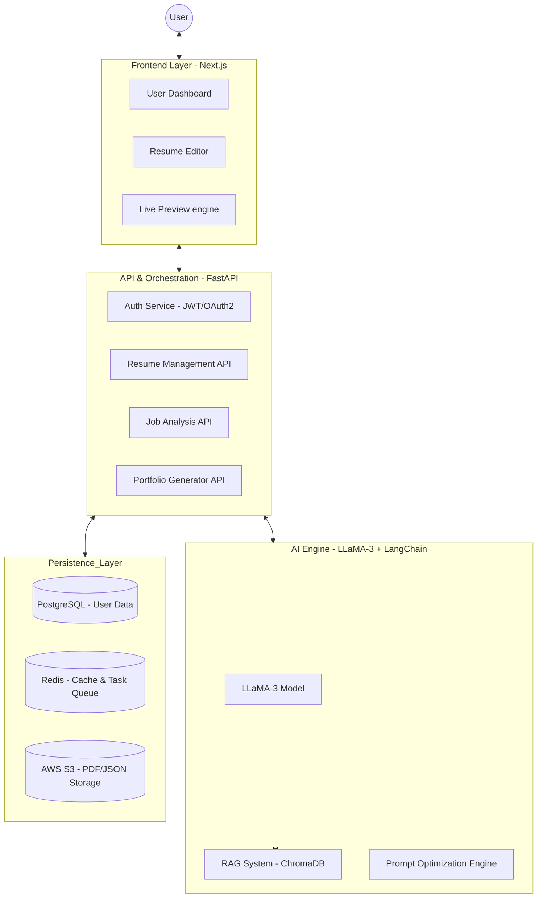

# System Architecture - AI Resume Builder

This document outlines the advanced system architecture of the **AI Resume Builder SaaS Platform**. The platform is designed for high scalability, responsiveness, and seamless AI integration.

---

## 🏗️ High-Level Architecture

The system follows a **decoupled micro-monolith architecture**, where the frontend, backend, and AI service layers are clearly separated to allow independent scaling and maintenance.

---

## 🛠️ Component Breakdown

### 1. Frontend Layer (Next.js)
- **Framework:** Next.js 14 (App Router) for Server-Side Rendering (SSR) and SEO optimization.
- **State Management:** **Zustand** for lightweight global state (managing resume draft data).
- **Styling:** **Tailwind CSS + ShadCN UI** for a premium, accessible UI.
- **Interactions:** **Framer Motion** for smooth transitions and the "WOW" factor.
- **Real-time Engine:** Local state synchronization with the backend via debounced API calls to ensure "Auto-save" functionality.

### 2. Backend API Layer (FastAPI)
- **High Performance:** FastAPI is used for its asynchronous capabilities, essential for handling long-running AI tasks.
- **Validation:** Pydantic models ensure strict data integrity.
- **Authentication:** OAuth2 with JWT tokens for secure user sessions.
- **WebHooks:** Integrated support for processing export completions and AI status updates.

### 3. AI & Intelligent Layer (LLaMA-3)
- **Model:** LLaMA-3 8B/70B (via Ollama for local or Groq for production speed).
- **Orchestration:** **LangChain** manages the flow between user input, vector database lookup, and model response.
- **Vector Database:** **ChromaDB** stores high-quality resume bullet points and ATS-optimized keywords to enhance AI outputs via RAG (Retrieval Augmented Generation).

### 4. Persistence & Storage
- **Relational Data:** PostgreSQL stores user profiles, resume metadata, and application history.
- **Caching:** Redis stores session data and caches AI-generated content to reduce latency and API costs.
- **Object Storage:** AWS S3 (or MinIO for local) stores generated PDF exports and uploaded profile pictures.

---

## 🔄 Data Flow: Resume Generation

1. **Input:** User provides basic details (Job Title, Experience level).
2. **Context Enrichment:** The AI service queries the Vector DB for "industry-standard" high-impact bullet points.
3. **Prompting:** A structured prompt is sent to LLaMA-3 containing user data + retrieved examples.
4. **Processing:** LLaMA-3 generates professional summaries and optimized descriptions.
5. **Formatting:** The output is mapped to a JSON structure compatible with the template engine.
6. **Rendering:** The Frontend renders the resume in real-time using HTML/CSS (allowing for PDF export via Puppeteer/ReportLab).

---

## 🔒 Security Architecture
- **Data Encryption:** TLS/SSL for all transit; sensitive fields encrypted at rest in PostgreSQL.
- **API Security:** Rate limiting via Redis to prevent AI resource exhaustion.
- **CORS:** Strict origin policies to allow only authorized frontend domains.

---

## 📈 Scalability Considerations
- **Horizontal Scaling:** The FastAPI backend can be scaled behind a Load Balancer.
- **Asynchronous Processing:** Heavy tasks like PDF generation or deep job analysis are delegated to **Celery** workers.
- **AI Infrastructure:** Production deployment uses specialized GPU-accelerated instances for low-latency LLaMA-3 inference.
